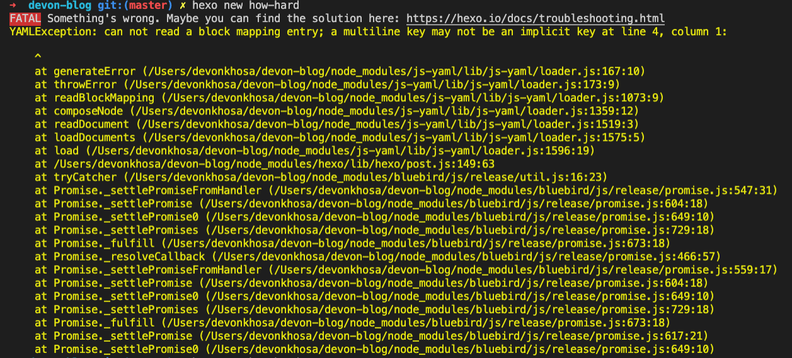
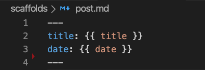

Creating a new post should not have been this hard, but it seems that I made extra work for myself. I edited the "scaffolds/post.md" file, removed the "tags:" line, and added my own comments in place. 

Well, when I decided to create a new post, hexo threw this error:

Once I removed my comment and left it looking like this:

Problem solved!